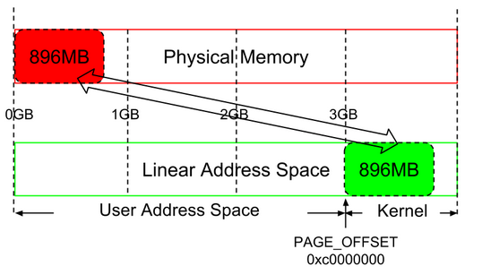
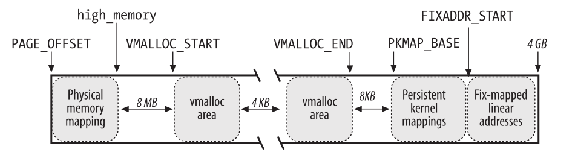
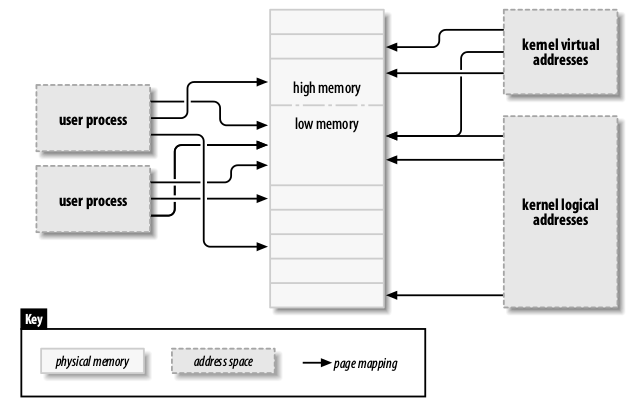

* TOC
{:toc}

### Page table generals

* cr3 in x86 or ttbr0 in arm, PGD, PMD and PTE all store the physical addresses
If they stores virtual addresses, they rely themselves to do address translation, it will be a dead loop.
* [`find_vma`](https://elixir.bootlin.com/linux/v3.4/source/mm/mmap.c#L1615) uses red-black tree search

### Kernel linear space
For 32-bit architecture, kernel linear address space is 1 GB (beginning from 0xc0000000), of which the highest 128 MB is reserved for high memory mappings, so only 896 MB is linear address space is left.

*Figure credit to Understanding the Linux Kernel*

* Therefore, If physical memory <= 896 MB, all of them can be mapped into kernel linear address space.
* If physical memory > 896, all memory above 896 MB is called high_memory, in order to access which, the kernel needs high memory mappings.
* The beginning is the linear addresses that directly maps the first 896MB of physical memory, also known as low memory, the end of directly mapped physical memory is stored in high_memory
* The linear addresses from VMALLOC_START to VMALLOC_END are for noncontiguous memory areas.
* Starting from PKMAP_BASE, the linear address is used for persistent kernel mapping of high memory frames.
* The end is for fix-mapped linear addresses, see Understanding the Linux Kernel, Page 72

#### kmalloc vs vmalloc
* kmalloc() function guarantees that the pages are physically contiguous (and virtually contiguous), thus the page frames need to be in low memory.
* vmalloc() function ensures only that the pages are contiguous within the virtual address space, thus the page frames can be in high momory.
* vmalloc linear address starts from VMALLOC_START, ends at VMALLOC_END
* vmalloc will get the free pages and map the pages by setting up page tables. The call chain is: [`vmalloc`](https://elixir.bootlin.com/linux/v3.18/source/mm/vmalloc.c#L1720) -> [`__vmalloc_node_flags`](https://elixir.bootlin.com/linux/v3.18/source/mm/vmalloc.c#L1704) -> [`__vmalloc_node`](https://elixir.bootlin.com/linux/v3.18/source/mm/vmalloc.c#L1689) -> [`__vmalloc_node_range`](https://elixir.bootlin.com/linux/v3.18/source/mm/vmalloc.c#L1632) -> [`__vmalloc_area_node`](https://elixir.bootlin.com/linux/v3.18/source/mm/vmalloc.c#L1559) -> [`map_vm_area`](https://elixir.bootlin.com/linux/v3.18/source/mm/vmalloc.c#L1273) -> [`vmap_page_range`](https://elixir.bootlin.com/linux/v3.18/source/mm/vmalloc.c#L199) -> [`vmap_page_range_noflush`](https://elixir.bootlin.com/linux/v3.18/source/mm/vmalloc.c#L178). In `vmap_page_range_noflush`, pgd, pud struct is allocated and set, the corresponding mapping is set. 

### Low memory mapping
* Low memory mapping is that the physical memory <= 896 MB is mapped in to kernel linear address space.
* As the low memory is mapped into kernel with a fixed offset, the kernel can use [`__pa(x)`](https://elixir.bootlin.com/linux/v3.10/source/arch/arm/include/asm/memory.h#L231) and [`__va(x)`](https://elixir.bootlin.com/linux/v3.10/source/arch/arm/include/asm/memory.h#L232),
which are backed up by [`__virt_to_phys(x)`](https://elixir.bootlin.com/linux/v3.10/source/arch/arm/include/asm/memory.h#L186) and [`__phys_to_virt(x)`](https://elixir.bootlin.com/linux/v3.10/source/arch/arm/include/asm/memory.h#L187) to do translation between va and pa.
* Note that low memory is only managed by the kernel, it can be used for either kernel or user space, as shown in the following figure.
Whenever the user space process needs a physical page frame (page fault), the kernel will allocate that page frame and set up the mapping in page table.
* The kernel logical address refers to the address space of low memory and the one allocated by kmalloc, details see Linux Device Drivers, Chapter 15

*Figure credit to Linux Device Drivers*

### High memory mapping
* For high memory who physical address is higher than 896MB cannot be mapped into kernel linear address space.
* The `high_memory` in the following figure is 3GB + 896MB.
* Kernel has 128 MB linear address space for high memory management.
* The kernel uses three ways to map page frames in high memory: permanent kernel mapping, temporary kernel mapping, and noncontiguous memory allocation.
* Permanent kernel mapping allows long lasting mapping through a dedicated Page Table at pkmap_page_table, usually can be set up by kmap_high and kunmap_high
* Temporary kernel mapping is done by mapping a high memory frame to a window in kernel address space, it never blocks the current process.

### Slab Allocator
* The slab layer divides different objects into groups called caches, each of which stores a different type of object.There is one cache per object type. For example, one cache is for process descriptors (a free list of task_struct structures), whereas another cache is for inode objects (struct inode).
* kmalloc() interface is built on top of the slab layer, using a family of general purpose caches.
* Kernel 3.10 now uses the slub to simplify slab

### Slub Allocator

#### General caches (kmalloc)
* Contains 11 general caches of size 2^3 to 2^13
* These caches are used for kmalloc
* Initialization: [`start_kernel`](https://elixir.bootlin.com/linux/v3.10/source/init/main.c#L471)  -> [`mm_init`](https://elixir.bootlin.com/linux/v3.10/source/init/main.c#L457) ->  [`kmem_cache_init`](https://elixir.bootlin.com/linux/v3.10/source/mm/slub.c#L3589) -> [`create_kmalloc_caches`](https://elixir.bootlin.com/linux/v3.10/source/mm/slab_common.c#L402)
* Allocation: [`kmalloc`](https://elixir.bootlin.com/linux/v3.10/source/include/linux/slub_def.h#L158) -> [`__kmalloc`](https://elixir.bootlin.com/linux/v3.10/source/mm/slub.c#L3221) ->  [`slab_alloc`](https://elixir.bootlin.com/linux/v3.10/source/mm/slub.c#L2399) -> [`slab_alloc_node`](https://elixir.bootlin.com/linux/v3.10/source/mm/slub.c#L2323) -> [`__slab_alloc`](https://elixir.bootlin.com/linux/v3.10/source/mm/slub.c#L2207) (If cpu_slab is empty, need to get a new slab) -> [`new_slab_objects`](https://elixir.bootlin.com/linux/v3.10/source/mm/slub.c#L2115) -> [`new_slab`](https://elixir.bootlin.com/linux/v3.10/source/mm/slub.c#L1343)

#### Specific caches
* Initialization: use the task_struct slab as an example, [`fork_init`](https://elixir.bootlin.com/linux/v3.10/source/kernel/fork.c#L252) -> [`kmem_cache_create`](https://elixir.bootlin.com/linux/v3.10/source/mm/slab_common.c#L244) will create the [`kmem_cache`](https://elixir.bootlin.com/linux/v3.10/source/include/linux/slub_def.h#L68) struct task_struct_cachep, the cpu_slab is still null, will get allocated when the first slab allocation happens
* Allocation: in function, [`alloc_task_struct_node`](https://elixir.bootlin.com/linux/v3.10/source/kernel/fork.c#L125), the cache task_struct_cachep will be used to allocate a new task_struct

Double mapping prevention puts hooks in new slab, which can intercept all memory allocated by general caches (kmalloc) and specific caches

### References
1. Understanding the Linux Kernel
2. Linux Device Drivers
3. Linux Kernel Development by Robert Love
