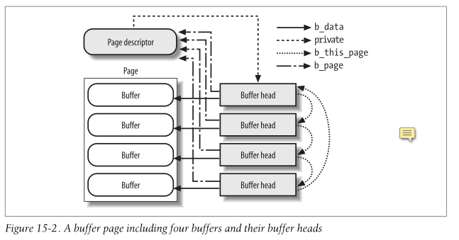

* TOC
{:toc}

### Data structures
* [`file`](https://elixir.bootlin.com/linux/v3.4/source/include/linux/fs.h#L976) a file struct represents a physical file's context, different processes, or even the same process can open one file multiple times, therefore has multiple file struct.
* [`dentry`](https://elixir.bootlin.com/linux/v3.4/source/include/linux/dcache.h#L88) multiple dentry can point to the same inode
* [`inode`](https://elixir.bootlin.com/linux/v3.4/source/include/linux/fs.h#L761) one-to-one mapping with the real file on disk

### Process and file
* [`task_struct`](https://elixir.bootlin.com/linux/v3.4/source/include/linux/sched.h#L1264) struct contains `struct fs_struct *fs` and `struct files_struct *files`
* [`fs_struct`](https://elixir.bootlin.com/linux/v3.4/source/include/linux/fs_struct.h#L8) defines the root directory of this process
* [`files_struct`](https://elixir.bootlin.com/linux/v3.4/source/include/linux/fdtable.h#L66) maintains a list of file struct than opened by this process


*Figure credit to Linux内核源代码情景分析*

### Page cache

* Page cache in kernel is organized per physical file, so it is contained in the inode, which is one-to-one mapping to physical file
* [`inode`](https://elixir.bootlin.com/linux/v3.4/source/include/linux/fs.h#L761) contains [`i_mapping`](https://elixir.bootlin.com/linux/v3.4/source/include/linux/fs.h#L775), which is [`address_space`](https://elixir.bootlin.com/linux/v3.4/source/include/linux/fs.h#L646) and contains the page cache for that file.
```c
struct address_space {
	struct inode		*host;		/* owner: inode, block_device */
	struct radix_tree_root	page_tree;	/* radix tree of all pages */
	spinlock_t		tree_lock;	/* and lock protecting it */
	unsigned int		i_mmap_writable;/* count VM_SHARED mappings */
	struct prio_tree_root	i_mmap;		/* tree of private and shared mappings */
	struct list_head	i_mmap_nonlinear;/*list VM_NONLINEAR mappings */
	struct mutex		i_mmap_mutex;	/* protect tree, count, list */
	/* Protected by tree_lock together with the radix tree */
	unsigned long		nrpages;	/* number of total pages */
	pgoff_t			writeback_index;/* writeback starts here */
	const struct address_space_operations *a_ops;	/* methods */
	unsigned long		flags;		/* error bits/gfp mask */
	struct backing_dev_info *backing_dev_info; /* device readahead, etc */
	spinlock_t		private_lock;	/* for use by the address_space */
	struct list_head	private_list;	/* ditto */
	struct address_space	*assoc_mapping;	/* ditto */
} __attribute__((aligned(sizeof(long))));
```
* `page_tree` contains the page cache, which is indexed by using radix tree. More details of page cache is in Understanding the Linux kernel, Chapter 15.


*Figure credit to Understanding the Linux Kernel*

 
* In order to be compatible with the underline block based device, the page cache all need to store the block, each page needs to point to a cyclic linked list with four buffer heads


*Figure credit to Understanding the Linux Kernel*


### References
1. Understanding the Linux Kernel
2. Linux内核源代码情景分析
