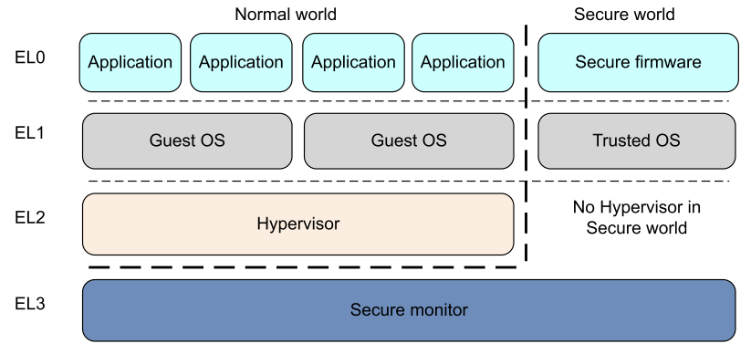
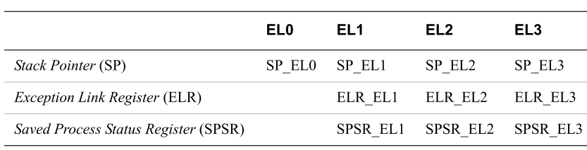

* TOC
{:toc}

### Exception levels and types

The following is a typical example of what software runs at each Exception level: 
* EL0 Normal user applications.
* EL1 Operating system kernel typically described as privileged.
* EL2 Hypervisor.
* EL3 Low-level firmware, including the Secure Monitor [1].

  
*Figure credit to Programmer’s Guide for ARMv8-A*

Exception can be divided into asynchronous exception and synchronous exception.  
Asynchronous exception includes IRQ and FIQ. FIQ is higher priority than IRQ, which is often reserved for secure interrupt sources.
Synchronous exception contains aborts and exception generated by certain instructions.
Aborts usually are generated by either failed instruction fetches, which is termed as instruction aborts, or failed data accesses, which is denoted data aborts. 

Exception can also be generated by certain instructions. 
* The Supervisor Call (SVC) instruction enables User mode programs to request an OS service.
* The Hypervisor Call (HVC) instruction enables the guest OS to request hypervisor services.
* The Secure monitor Call (SMC) instruction enables the Normal world to request Secure world services [1].

### Registers
The location in memory where the handler is stored is called the exception vector. In the ARM architecture, exception vectors are stored in a table, called the exception vector table. Each Exception level has its own vector table, that is, there is one for each of EL3, EL2 and EL1. The virtual address of each table base is set by the Vector Based Address Registers VBAR_EL3, VBAR_EL2 and VBAR_EL1[1].

The Exception Syndrome Register (ESR_ELn) gives information about the reasons for the exception. The Fault Address Register (FAR_ELn) holds the faulting virtual address for all synchronous instruction and Data Aborts and alignment faults.
The Exception Link Register (ELR_ELn) holds the address of the instruction which caused the aborting data access (for Data Aborts). [1]

  
*Figure credit to Programmer’s Guide for ARMv8-A*

### Code walk-through
In linux kernel 3.18, the exception vector table for kernel is defined in [`vectors`](https://elixir.bootlin.com/linux/v3.18/source/arch/arm64/kernel/entry.S#L183) in entry.S. It will be loaded into VBAR_EL1 in [`__enable_mmu`](https://elixir.bootlin.com/linux/v3.18/source/arch/arm64/kernel/head.S#L449) in head.S

For example, when a process tries to access a data memory address that belongs to it, but not get allocated yet, MMU will generate a data abort, the execution path will be transferred from user space to el0_sync in the vector table in VBAR_EL1.

```
.macro ventry  label
.align  7
b       \label
.endm

/*
 * Exception vectors.
 */

	.align	11
ENTRY(vectors)
	ventry	el1_sync_invalid		// Synchronous EL1t
	ventry	el1_irq_invalid			// IRQ EL1t
	ventry	el1_fiq_invalid			// FIQ EL1t
	ventry	el1_error_invalid		// Error EL1t

	ventry	el1_sync			// Synchronous EL1h
	ventry	el1_irq				// IRQ EL1h
	ventry	el1_fiq_invalid			// FIQ EL1h
	ventry	el1_error_invalid		// Error EL1h

	ventry	el0_sync			// Synchronous 64-bit EL0
	ventry	el0_irq				// IRQ 64-bit EL0
	ventry	el0_fiq_invalid			// FIQ 64-bit EL0
	ventry	el0_error_invalid		// Error 64-bit EL0

#ifdef CONFIG_COMPAT
	ventry	el0_sync_compat			// Synchronous 32-bit EL0
	ventry	el0_irq_compat			// IRQ 32-bit EL0
	ventry	el0_fiq_invalid_compat		// FIQ 32-bit EL0
	ventry	el0_error_invalid_compat	// Error 32-bit EL0
#else
	ventry	el0_sync_invalid		// Synchronous 32-bit EL0
	ventry	el0_irq_invalid			// IRQ 32-bit EL0
	ventry	el0_fiq_invalid			// FIQ 32-bit EL0
	ventry	el0_error_invalid		// Error 32-bit EL0
#endif
END(vectors)
```
el0_sync is defined in
```
        .align  6
el0_sync:
        kernel_entry 0
        mrs     x25, esr_el1                    // read the syndrome register
        lsr     x24, x25, #ESR_EL1_EC_SHIFT     // exception class
        cmp     x24, #ESR_EL1_EC_SVC64          // SVC in 64-bit state
        b.eq    el0_svc
        cmp     x24, #ESR_EL1_EC_DABT_EL0       // data abort in EL0
        b.eq    el0_da
        cmp     x24, #ESR_EL1_EC_IABT_EL0       // instruction abort in EL0
        b.eq    el0_ia
        cmp     x24, #ESR_EL1_EC_FP_ASIMD       // FP/ASIMD access
        b.eq    el0_fpsimd_acc
        cmp     x24, #ESR_EL1_EC_FP_EXC64       // FP/ASIMD exception
        b.eq    el0_fpsimd_exc
        cmp     x24, #ESR_EL1_EC_SYS64          // configurable trap
        b.eq    el0_undef
        cmp     x24, #ESR_EL1_EC_SP_ALIGN       // stack alignment exception
        b.eq    el0_sp_pc
        cmp     x24, #ESR_EL1_EC_PC_ALIGN       // pc alignment exception
        b.eq    el0_sp_pc
        cmp     x24, #ESR_EL1_EC_UNKNOWN        // unknown exception in EL0
        b.eq    el0_undef
        cmp     x24, #ESR_EL1_EC_BREAKPT_EL0    // debug exception in EL0
        b.ge    el0_dbg
        b       el0_inv
```

For a syscall, it will go to [`el0_svc`](https://elixir.bootlin.com/linux/v3.18/source/arch/arm64/kernel/entry.S#L644), which will jump to the corresponding syscalls in the syscall table. But here, we have data abort, which will go to el0_da, who will call the [`do_mem_abort`](https://elixir.bootlin.com/linux/v3.18/source/arch/arm64/mm/fault.c#L454).

```
el0_da:
        /*
         * Data abort handling
         */
        mrs     x26, far_el1
        // enable interrupts before calling the main handler
        enable_dbg_and_irq
        ct_user_exit
        bic     x0, x26, #(0xff << 56)
        mov     x1, x25
        mov     x2, sp
        adr     lr, ret_to_user
        b       do_mem_abort
```


do_mem_abort contains a struct called [`fault_info`](https://elixir.bootlin.com/linux/v3.18/source/arch/arm64/mm/fault.c#L378), which can handle both instruction aborts and data aborts. In this case, do_mem_abort will call [`do_page_fault`](https://elixir.bootlin.com/linux/v3.18/source/arch/arm64/mm/fault.c#L194) to map the real physical pages.


### References
1. [Programmer’s Guide for ARMv8-A](http://infocenter.arm.com/help/topic/com.arm.doc.den0024a/DEN0024A_v8_architecture_PG.pdf)
