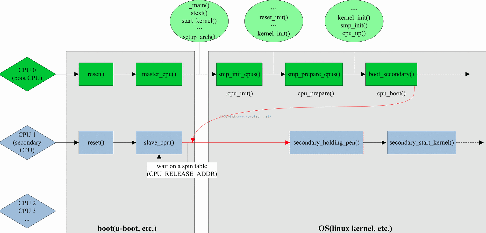

* TOC
{:toc}

### Early age: need to wait
The primary core boot up for linux kernel start at [`stext`](https://elixir.bootlin.com/linux/v4.9.35/source/arch/arm64/kernel/head.S#L221), while the secondary core starts from [`secondary_holding_pen`](https://elixir.bootlin.com/linux/v4.9.35/source/arch/arm64/kernel/head.S#L662). The secondary core will loop in secondary_holding_pen until certain condition is met.

### Middle age: finally can move on
After the primary core goes through head.S and the most of the functions in [`start_kernel`](https://elixir.bootlin.com/linux/v4.9.35/source/init/main.c#L479), it will spawn a kernel thread in [`rest_init`](https://elixir.bootlin.com/linux/v4.9.35/source/init/main.c#L383), which will eventually run [`kernel_init`](https://elixir.bootlin.com/linux/v4.9.35/source/init/main.c#L938) --> [`kernel_init_freeable`](https://elixir.bootlin.com/linux/v4.9.35/source/init/main.c#L985) -->  [`smp_init`](https://elixir.bootlin.com/linux/v4.9.35/source/kernel/smp.c#L552). 

* smp_init will call `idle_threads_init` to fork a swapper for each cpu, share the same PID but with different thread_info and task_struct, as shown below.

```
void __init smp_init(void)
{
	unsigned int cpu;

	idle_threads_init();
	cpuhp_threads_init();

	/* FIXME: This should be done in userspace --RR */
	for_each_present_cpu(cpu) {
		if (num_online_cpus() >= setup_max_cpus)
			break;
		if (!cpu_online(cpu))
			cpu_up(cpu);
	}

	/* Any cleanup work */
	smp_announce();
	smp_cpus_done(setup_max_cpus);
}


void __init idle_threads_init(void)
{
	unsigned int cpu, boot_cpu;

	boot_cpu = smp_processor_id();

	for_each_possible_cpu(cpu) {
		if (cpu != boot_cpu)
			idle_init(cpu);
	}
}


static inline void idle_init(unsigned int cpu)
{
	struct task_struct *tsk = per_cpu(idle_threads, cpu);

	if (!tsk) {
		tsk = fork_idle(cpu);
		if (IS_ERR(tsk))
			pr_err("SMP: fork_idle() failed for CPU %u\n", cpu);
		else
			per_cpu(idle_threads, cpu) = tsk;
	}
}
```

* Then, for each core, smp_init will call [`cpu_up`](https://elixir.bootlin.com/linux/v4.9.35/source/kernel/cpu.c#L1093) --> [`do_cpu_up`](https://elixir.bootlin.com/linux/v4.9.35/source/kernel/cpu.c#L1063) --> [`_cpu_up`](https://elixir.bootlin.com/linux/v4.9.35/source/kernel/cpu.c#L1005).

```
static int _cpu_up(unsigned int cpu, int tasks_frozen, enum cpuhp_state target)
{
	......
	target = min((int)target, CPUHP_BRINGUP_CPU);
	ret = cpuhp_up_callbacks(cpu, st, target);
out:
	cpu_hotplug_done();
	return ret;
}

static int cpuhp_up_callbacks(unsigned int cpu, struct cpuhp_cpu_state *st,
			      enum cpuhp_state target)
{
	enum cpuhp_state prev_state = st->state;
	int ret = 0;

	while (st->state < target) {
		st->state++;
		ret = cpuhp_invoke_callback(cpu, st->state, true, NULL);
		if (ret) {
			st->target = prev_state;
			undo_cpu_up(cpu, st);
			break;
		}
	}
	return ret;
}


static struct cpuhp_step cpuhp_bp_states[] = {
	[CPUHP_BRINGUP_CPU] = {
		.name			= "cpu:bringup",
		.startup.single		= bringup_cpu,
		.teardown.single	= NULL,
		.cant_stop		= true,
	},
};

static int cpuhp_invoke_callback(unsigned int cpu, enum cpuhp_state state,
				 bool bringup, struct hlist_node *node)
{
	......
	if (!step->multi_instance) {
		cb = bringup ? step->startup.single : step->teardown.single;
		ret = cb(cpu);
	}
	......
}
```


[`_cpu_up`](https://elixir.bootlin.com/linux/v4.9.35/source/kernel/cpu.c#L1005) -> cpuhp_up_callbacks -> cpuhp_invoke_callback, which will call cpuhp_bp_states->startup.single, which points to [`bringup_cpu`](https://elixir.bootlin.com/linux/v4.9.35/source/kernel/cpu.c#L421).
bringup_cpu -> [`__cpu_up`](https://elixir.bootlin.com/linux/v4.9.35/source/arch/arm64/kernel/smp.c#L140) -> [`boot_secondary`](https://elixir.bootlin.com/linux/v4.9.35/source/arch/arm64/kernel/smp.c#L130) --> cpu_ops[cpu]->cpu_boot, which is [`smp_spin_table_cpu_boot`](https://elixir.bootlin.com/linux/v4.9.35/source/arch/arm64/kernel/smp_spin_table.c#L115) --> [`write_pen_release`](https://elixir.bootlin.com/linux/v4.9.35/source/arch/arm64/kernel/smp_spin_table.c#L43).

```
static void write_pen_release(u64 val)
{
	void *start = (void *)&secondary_holding_pen_release;
	unsigned long size = sizeof(secondary_holding_pen_release);

	secondary_holding_pen_release = val;
	__flush_dcache_area(start, size);
}


ENTRY(secondary_holding_pen)
	bl	el2_setup			// Drop to EL1, w0=cpu_boot_mode
	bl	set_cpu_boot_mode_flag
	mrs	x0, mpidr_el1
	mov_q	x1, MPIDR_HWID_BITMASK
	and	x0, x0, x1
	adr_l	x3, secondary_holding_pen_release
pen:	ldr	x4, [x3]
	cmp	x4, x0
	b.eq	secondary_startup
	wfe
	b	pen
ENDPROC(secondary_holding_pen)
```
 In [`write_pen_release`](https://elixir.bootlin.com/linux/v4.9.35/source/arch/arm64/kernel/smp_spin_table.c#L43), the variable `secondary_holding_pen_release` will be updated, which allows the secondary core breaks the loop of secondary_holding_pen, the boot process can finally move on. 

### Modern age: jump to C world

```
secondary_startup:
	/*
	 * Common entry point for secondary CPUs.
	 */
	bl	__cpu_setup			// initialise processor
	bl	__enable_mmu
	ldr	x8, =__secondary_switched
	br	x8
ENDPROC(secondary_startup)

__secondary_switched:
	adr_l	x5, vectors
	msr	vbar_el1, x5
	isb

	adr_l	x0, secondary_data
	ldr	x0, [x0, #CPU_BOOT_STACK]	// get secondary_data.stack
	mov	sp, x0
	and	x0, x0, #~(THREAD_SIZE - 1)
	msr	sp_el0, x0			// save thread_info
	mov	x29, #0
	b	secondary_start_kernel
ENDPROC(__secondary_switched)

// in arch/arm64/kernel/smp.c
asmlinkage void secondary_start_kernel(void) {}
```

`secondary_holding_pen` -> `secondary_startup` -> `__secondary_switched` -> `secondary_start_kernel`, which is in arch/arm64/kernel/smp.c. The secondary bootup is done.
To summarize, a figure from wowotech explains the overall secondary core bootup steps. 


*Figure credit to wowotech.net*


### References
1. [Linux CPU core的电源管理(3)_cpu ops](http://www.wowotech.net/pm_subsystem/cpu_ops.html)
