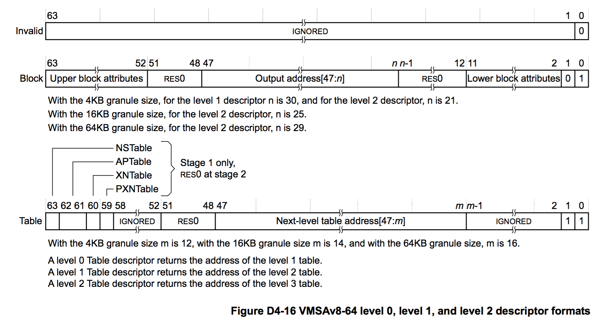
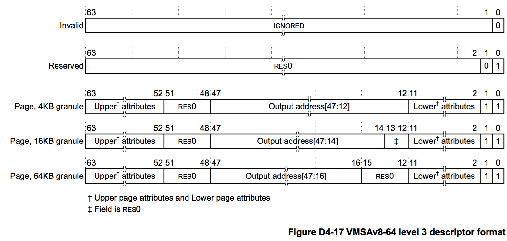

* TOC
{:toc}

### Page table formats

From [VMSAv8-64 translation table format descriptors](https://armv8-ref.codingbelief.com/en/chapter_d4/d43_1_vmsav8-64_translation_table_descriptor_formats.html), we know the Level 0, 1, 2 and Level 3 translation table descriptor formats are:

  
*Figure credit to ARM Architecture Reference Manual for ARMv8-A*


*Figure credit to ARM Architecture Reference Manual for ARMv8-A*

For AArch64, a page table entry has 64 bits. From above figures, we know that Linux kernel page table can use up to 48 bits. Memory Layout on AArch64 Linux is documented in linux kernel source [Documentation/arm64/memory.txt](https://elixir.bootlin.com/linux/v4.14.68/source/Documentation/arm64/memory.txt).
```
AArch64 Linux memory layout with 4KB pages + 3 levels:
Start			End			Size		Use
-----------------------------------------------------------------------
0000000000000000	0000007fffffffff	 512GB		user
ffffff8000000000	ffffffffffffffff	 512GB		kernel


AArch64 Linux memory layout with 4KB pages + 4 levels:
Start			End			Size		Use
-----------------------------------------------------------------------
0000000000000000	0000ffffffffffff	 256TB		user
ffff000000000000	ffffffffffffffff	 256TB		kernel


AArch64 Linux memory layout with 64KB pages + 2 levels:
Start			End			Size		Use
-----------------------------------------------------------------------
0000000000000000	000003ffffffffff	   4TB		user
fffffc0000000000	ffffffffffffffff	   4TB		kernel


AArch64 Linux memory layout with 64KB pages + 3 levels:
Start			End			Size		Use
-----------------------------------------------------------------------
0000000000000000	0000ffffffffffff	 256TB		user
ffff000000000000	ffffffffffffffff	 256TB		kernel
```

I use 4KB pages + 3 levels in the following of this post. Each page table entry has 64 bits. The page frame size is 4KB, so each page frame contains 512 entries. For 3 level, in total 9+9+9+12=39 bits are used. Each Level 1 PGT entry indexs 2^30=1GB memory, level 2 indexs 2MB memory, and level 3 indexs 4KB memory.

### Dump kernel page table
Linux kernel supports dump kernel page table, the commit for arm64 kernel is [arm64: add support to dump the kernel page tables](https://patchwork.kernel.org/patch/5323931/). 
The source code is in [arch/arm64/mm/dump.c](https://elixir.bootlin.com/linux/v4.14.68/source/arch/arm64/mm/dump.c) and [arch/arm64/mm/ptdump_debugfs.c](https://elixir.bootlin.com/linux/v4.14.68/source/arch/arm64/mm/ptdump_debugfs.c).
```
// For Android common kernel v4.9.126
CONFIG_ARM64_PTDUMP=y

// For Android common kernel v4.14.68
CONFIG_ARM64_PTDUMP_CORE=y
CONFIG_ARM64_PTDUMP_DEBUGFS=y

mount -t debugfs nodev /sys/kernel/debug
cat /sys/kernel/debug/kernel_page_tables
```
By enabling related configs and mount debugfs, we can dump kernel page table. My kernel is Android common kernel v4.14.68 defconf, full result is attached at the end. Here we pick the kernel code and rodata area out, together with the booting log.
```
// cat /sys/kernel/debug/kernel_page_tables
0xffffff8008080000-0xffffff8008200000        1536K PTE       ro x  SHD AF NG CON     UXN MEM/NORMAL
0xffffff8008200000-0xffffff8008c00000          10M PMD       ro x  SHD AF NG     BLK UXN MEM/NORMAL
0xffffff8008c00000-0xffffff8008ce0000         896K PTE       ro x  SHD AF NG CON     UXN MEM/NORMAL
0xffffff8008ce0000-0xffffff8008e00000        1152K PTE       ro NX SHD AF NG         UXN MEM/NORMAL
0xffffff8008e00000-0xffffff8009000000           2M PMD       ro NX SHD AF NG     BLK UXN MEM/NORMAL
0xffffff8009000000-0xffffff80091e0000        1920K PTE       ro NX SHD AF NG         UXN MEM/NORMAL
0xffffff8009680000-0xffffff8009800000        1536K PTE       RW NX SHD AF NG CON     UXN MEM/NORMAL

// Booting log
[    0.000000] Virtual kernel memory layout:
[    0.000000]     modules : 0xffffff8000000000 - 0xffffff8008000000   (   128 MB)
[    0.000000]     vmalloc : 0xffffff8008000000 - 0xffffffbebfff0000   (   250 GB)
[    0.000000]       .text : 0xffffff8008080000 - 0xffffff8008ce0000   ( 12672 KB)
[    0.000000]     .rodata : 0xffffff8008ce0000 - 0xffffff80091e0000   (  5120 KB)
[    0.000000]       .init : 0xffffff80091e0000 - 0xffffff8009680000   (  4736 KB)
[    0.000000]       .data : 0xffffff8009680000 - 0xffffff8009865a00   (  1943 KB)
[    0.000000]        .bss : 0xffffff8009865a00 - 0xffffff800a472948   ( 12340 KB)
[    0.000000]     fixed   : 0xffffffbefe7f9000 - 0xffffffbefec00000   (  4124 KB)
[    0.000000]     PCI I/O : 0xffffffbefee00000 - 0xffffffbeffe00000   (    16 MB)
[    0.000000]     vmemmap : 0xffffffbf00000000 - 0xffffffc000000000   (     4 GB maximum)
[    0.000000]               0xffffffbf00000000 - 0xffffffbf02000000   (    32 MB actual)
[    0.000000]     memory  : 0xffffffc000000000 - 0xffffffc080000000   (  2048 MB)
```
From the above log, we can see that 
1. Only kernel text is marked with X, all others are XN (here XN is PXN)
2. Kernel text head and tail break down to 4KB, middle 10MB is 2MB mapped. 
3. RO data is marked RO, also its head and tail break down to 4KB.

### Dump raw page tables
Kernel contains three pg_dirs, [`idmap_pg_dir`](https://elixir.bootlin.com/linux/v4.14.68/source/arch/arm64/kernel/vmlinux.lds.S#L219) for identity mapping, [`swapper_pg_dir`](https://elixir.bootlin.com/linux/v4.14.68/source/arch/arm64/kernel/vmlinux.lds.S#L221) for kernel page table, and [`tramp_pg_dir`](https://elixir.bootlin.com/linux/v4.14.68/source/arch/arm64/kernel/vmlinux.lds.S#L230) for meltdown fix trampoline.

```
ffffff800a473000 A idmap_pg_dir
ffffff800a476000 A swapper_pg_dir
ffffff800a478000 A tramp_pg_dir
```

A PGD page contains 512 entris, each entry indexs 1GB (0x4000 0000) memory.
The indexed virtual address is linear (the mapped physical address is random), for example, swapper_pg_dir entry 0 indexs address from 
```
INDEX	ADDR_START
0	0xffffff80 00000000
1	0xffffff80 40000000
2	0xffffff80 80000000
3	0xffffff80 c0000000
4	0xffffff81 00000000
...
```

#### What is mapped in swapper_pg_dir

By printing out the raw page table entry in [`walk_pgd`](https://elixir.bootlin.com/linux/v4.14.68/source/arch/arm64/mm/dump.c#L335), we get the non-zero entries of `swapper_pg_dir` as follows. 
```
INDEX	ADDR_START		CONTENT
0	0xffffff80 00000000	beffe803 //Kernel chunk
250	0xffffffbe 80000000	bb7be003 //0xffffffbebffd7000-0xffffffbebffda000
251	0xffffffbe c0000000	41867803 //Fixmap
252	0xffffffbf 00000000	bede4803 //vmemmap
256	0xffffffc0 00000000	beff7803 //Linear mapping kernel chunk
257	0xffffffc0 40000000	e8000080000f11 //Linear mapping 1GB block
```

#### How to translate VA to PA
OS text book always has the figure of how translation happens. Here we use the fixed map 0xffffffbefe7f9000 as a real world example.
```
INDEX 63 		         38         29         20         11         0
      1111111111111111111111111  011111011  111110011  111111001  000000000000 //binary of 0xffffffbefe7f9000 
```
Here we get L1 index is 0b011111011, which is 251, its content 0x41867803. 
From its format, we know it points to the page at physical address 0x41867000.

With the physical address, OS text book would say OS can read the L2 entries from this physical page directly, which is correct. But Linux kernel only knows virtual address, it cannot recognize physical address. If kernel wants to walk page table manually, it needs to convert the PA to VA. Therefore, with the L2 physical page address, Linux first converts it to VA.
```
static void walk_pud(struct pg_state *st, pgd_t *pgd, unsigned long start)
{
	pud_t *pud = pud_offset(pgd, 0UL);
	unsigned long addr;
	unsigned i;

	for (i = 0; i < PTRS_PER_PUD; i++, pud++) {
		addr = start + i * PUD_SIZE;
		if (pud_none(*pud) || pud_sect(*pud)) {
			note_page(st, addr, 2, pud_val(*pud));
		} else {
			BUG_ON(pud_bad(*pud));
			walk_pmd(st, pud, addr);
		}
	}
}

#define pud_offset(dir, addr)		((pud_t *)__va(pud_offset_phys((dir), (addr))))
```
Here another question why not store VA directly in page table?
Remember page table is for MMU, the hardware, who operates on physical address, needs the physical address.
Page table is mainly for MMU, therefore it stores physical address. If kernel wants to walk page table manually, it needs to convert the PA to VA. This is how to find L2 page, similar, kernel can use bits from 29 - 21 to calculate the index of L2 entry, use bits from 20 - 12 to calculate index of L3 entry and find the PTE entry. Combining the PTE entry output address with bits 11 - 0, that is the physical address of the input virtual address.

#### What is mapped in idmap_pg_dir
`idmap_pg_dir` is for identity mapping. The PHYS_OFFSET is 0x4000 0000 (1GB). 
The content is
```
	INDEX	ADDR_START	CONTENT
PGD 	1	0x4000 0000	42474003
PMD 	6	0x4060 0000	40c00711
```
Note that here virtual address 0x4060 0000 maps physical address 0x40c0 0000 2MB chunk. 
Only this 2MB is mapped in idmap_pg_dir. Then what is in this mapped 2MB?

From `virt_to_phys` and `kimage_voffset`, we can caculate the virtual address of this 2MB is 0xffffff8008c00000.
It is easy to find that  `__idmap_text_start` and `__idmap_text_end` are within this 2MB.
The mapped functions are: 
```
ffffff8008ccf000 T __idmap_text_start
ffffff8008ccf000 T kimage_vaddr
ffffff8008ccf008 T el2_setup
ffffff8008ccf054 t set_hcr
ffffff8008ccf104 t install_el2_stub
ffffff8008ccf138 t set_cpu_boot_mode_flag
ffffff8008ccf15c T secondary_holding_pen
ffffff8008ccf180 t pen
ffffff8008ccf194 T secondary_entry
ffffff8008ccf1a0 t secondary_startup
ffffff8008ccf1b0 t __secondary_switched
ffffff8008ccf1e4 T __enable_mmu
ffffff8008ccf238 t __no_granule_support
ffffff8008ccf25c t __primary_switch
ffffff8008ccf280 T cpu_resume
ffffff8008ccf2a0 T __cpu_soft_restart
ffffff8008ccf2e0 T cpu_do_resume
ffffff8008ccf350 T idmap_cpu_replace_ttbr1
ffffff8008ccf380 t __idmap_kpti_flag
ffffff8008ccf384 T idmap_kpti_install_ng_mappings
ffffff8008ccf3bc t do_pgd
ffffff8008ccf3d4 t next_pgd
ffffff8008ccf3e4 t skip_pgd
ffffff8008ccf418 t walk_puds
ffffff8008ccf420 t next_pud
ffffff8008ccf424 t walk_pmds
ffffff8008ccf42c t do_pmd
ffffff8008ccf444 t next_pmd
ffffff8008ccf454 t skip_pmd
ffffff8008ccf464 t walk_ptes
ffffff8008ccf46c t do_pte
ffffff8008ccf490 t skip_pte
ffffff8008ccf4a0 t __idmap_kpti_secondary
ffffff8008ccf4e4 T __cpu_setup
ffffff8008ccf5bc t crval
ffffff8008ccf5d8 T __idmap_text_end
```
In head.S, [`__create_page_tables`](https://elixir.bootlin.com/linux/v4.14.68/source/arch/arm64/kernel/head.S#L244) will fill the entries of `idmap_pg_dir`.


#### What is mapped in tramp_pg_dir
```
	INDEX	ADDR_START		CONTENT
PGD	251	0xffffffbe c0000000	bc0df003
PMD	499	0xffffffbe fe600000	bc0e0003
PTE	506	0xffffffbe fe7fa000	c0000040cd1793

0xffffffbefe7fa000-0xffffffbefe7fb000           4K PTE       ro x  SHD AF            UXN MEM/NORMAL
```
Only one page is mapped inside tramp_pg_dir. 
In [`map_entry_trampoline`](https://elixir.bootlin.com/linux/v4.14.68/source/arch/arm64/mm/mmu.c#L533), 
```
static int __init map_entry_trampoline(void)
{
	......
	phys_addr_t pa_start = __pa_symbol(__entry_tramp_text_start);
	......
	__set_fixmap(FIX_ENTRY_TRAMP_TEXT, pa_start, prot);
	......
}

ffffff8008cd1000 T __entry_tramp_text_start
ffffff8008cd1000 T tramp_vectors
ffffff8008cd17c8 T tramp_exit_native
ffffff8008cd17e8 T tramp_exit_compat
ffffff8008cd2000 T __entry_tramp_text_end
```
Therefore, the mapping page only contains tramp_vectors, tramp_exit_native and tramp_exit_compat, which include tramp_map/unmap_kernel.
These functions are fixed mapped to avoid leaking any kernel text ASLR information.


### Full output of dumping swapper_pg_dir
```
# cat /sys/kernel/debug/kernel_page_tables 
---[ Modules start ]---
---[ Modules end ]---
---[ vmalloc() Area ]---
0xffffff8008000000-0xffffff8008004000          16K PTE       RW NX SHD AF NG         UXN MEM/NORMAL
0xffffff8008005000-0xffffff8008006000           4K PTE       RW NX SHD AF NG         UXN DEVICE/nGnRE
0xffffff8008007000-0xffffff800800f000          32K PTE       RW NX SHD AF NG         UXN MEM/NORMAL
0xffffff8008010000-0xffffff8008020000          64K PTE       RW NX SHD AF NG         UXN DEVICE/nGnRE
0xffffff8008021000-0xffffff8008029000          32K PTE       RW NX SHD AF NG         UXN MEM/NORMAL
0xffffff800802a000-0xffffff800802b000           4K PTE       ro NX SHD AF NG         UXN MEM/NORMAL
0xffffff8008030000-0xffffff8008040000          64K PTE       RW NX SHD AF NG         UXN DEVICE/nGnRE
0xffffff8008043000-0xffffff8008044000           4K PTE       RW NX SHD AF NG         UXN DEVICE/nGnRE
0xffffff8008045000-0xffffff8008046000           4K PTE       RW NX SHD AF NG         UXN DEVICE/nGnRE
0xffffff8008048000-0xffffff800804c000          16K PTE       RW NX SHD AF NG         UXN MEM/NORMAL
0xffffff8008050000-0xffffff8008054000          16K PTE       RW NX SHD AF NG         UXN MEM/NORMAL
0xffffff8008058000-0xffffff800805c000          16K PTE       RW NX SHD AF NG         UXN MEM/NORMAL
0xffffff8008060000-0xffffff8008064000          16K PTE       RW NX SHD AF NG         UXN MEM/NORMAL
0xffffff8008068000-0xffffff800806c000          16K PTE       RW NX SHD AF NG         UXN MEM/NORMAL
0xffffff8008070000-0xffffff8008074000          16K PTE       RW NX SHD AF NG         UXN MEM/NORMAL
0xffffff8008078000-0xffffff800807c000          16K PTE       RW NX SHD AF NG         UXN MEM/NORMAL
0xffffff8008080000-0xffffff8008200000        1536K PTE       ro x  SHD AF NG CON     UXN MEM/NORMAL
0xffffff8008200000-0xffffff8008c00000          10M PMD       ro x  SHD AF NG     BLK UXN MEM/NORMAL
0xffffff8008c00000-0xffffff8008ce0000         896K PTE       ro x  SHD AF NG CON     UXN MEM/NORMAL
0xffffff8008ce0000-0xffffff8008e00000        1152K PTE       ro NX SHD AF NG         UXN MEM/NORMAL
0xffffff8008e00000-0xffffff8009000000           2M PMD       ro NX SHD AF NG     BLK UXN MEM/NORMAL
0xffffff8009000000-0xffffff80091e0000        1920K PTE       ro NX SHD AF NG         UXN MEM/NORMAL
0xffffff8009680000-0xffffff8009800000        1536K PTE       RW NX SHD AF NG CON     UXN MEM/NORMAL
0xffffff8009800000-0xffffff800a400000          12M PMD       RW NX SHD AF NG     BLK UXN MEM/NORMAL
0xffffff800a400000-0xffffff800a470000         448K PTE       RW NX SHD AF NG CON     UXN MEM/NORMAL
0xffffff800a470000-0xffffff800a479000          36K PTE       RW NX SHD AF NG         UXN MEM/NORMAL
0xffffff800a47a000-0xffffff800a67a000           2M PTE       RW NX SHD AF NG         UXN MEM/NORMAL
0xffffff800a67b000-0xffffff800a77b000           1M PTE       RW NX SHD AF NG         UXN MEM/NORMAL
0xffffff800a780000-0xffffff800a784000          16K PTE       RW NX SHD AF NG         UXN MEM/NORMAL
0xffffff800a788000-0xffffff800a78c000          16K PTE       RW NX SHD AF NG         UXN MEM/NORMAL
0xffffff800a790000-0xffffff800a794000          16K PTE       RW NX SHD AF NG         UXN MEM/NORMAL
0xffffff800a798000-0xffffff800a79c000          16K PTE       RW NX SHD AF NG         UXN MEM/NORMAL
0xffffff800a7a0000-0xffffff800a7a4000          16K PTE       RW NX SHD AF NG         UXN MEM/NORMAL
0xffffff800a7a8000-0xffffff800a7ac000          16K PTE       RW NX SHD AF NG         UXN MEM/NORMAL
0xffffff800a7b0000-0xffffff800a7b4000          16K PTE       RW NX SHD AF NG         UXN MEM/NORMAL
0xffffff800a7b8000-0xffffff800a7bc000          16K PTE       RW NX SHD AF NG         UXN MEM/NORMAL
0xffffff800a7c0000-0xffffff800a7c4000          16K PTE       RW NX SHD AF NG         UXN MEM/NORMAL
0xffffff800a7cd000-0xffffff800a7d5000          32K PTE       RW NX SHD AF NG         UXN MEM/NORMAL
0xffffff800a7f0000-0xffffff800a7f4000          16K PTE       RW NX SHD AF NG         UXN MEM/NORMAL
0xffffff800a845000-0xffffff800a846000           4K PTE       RW NX SHD AF NG         UXN DEVICE/nGnRE
0xffffff800a84d000-0xffffff800a84e000           4K PTE       RW NX SHD AF NG         UXN DEVICE/nGnRE
0xffffff800a855000-0xffffff800a856000           4K PTE       RW NX SHD AF NG         UXN DEVICE/nGnRE
0xffffff800a85d000-0xffffff800a85e000           4K PTE       RW NX SHD AF NG         UXN DEVICE/nGnRE
0xffffff800a865000-0xffffff800a866000           4K PTE       RW NX SHD AF NG         UXN DEVICE/nGnRE
0xffffff800a86d000-0xffffff800a86e000           4K PTE       RW NX SHD AF NG         UXN DEVICE/nGnRE
0xffffff800a88d000-0xffffff800a8cd000         256K PTE       RW NX SHD AF NG         UXN MEM/NORMAL-NC
0xffffff800aac0000-0xffffff800aac4000          16K PTE       RW NX SHD AF NG         UXN MEM/NORMAL
0xffffff800adc8000-0xffffff800adcc000          16K PTE       RW NX SHD AF NG         UXN MEM/NORMAL
0xffffff800adf8000-0xffffff800adfc000          16K PTE       RW NX SHD AF NG         UXN MEM/NORMAL
0xffffff800ae08000-0xffffff800ae0c000          16K PTE       RW NX SHD AF NG         UXN MEM/NORMAL
0xffffff800ae10000-0xffffff800ae14000          16K PTE       RW NX SHD AF NG         UXN MEM/NORMAL
0xffffff800ae18000-0xffffff800ae1c000          16K PTE       RW NX SHD AF NG         UXN MEM/NORMAL
0xffffff800ae20000-0xffffff800ae24000          16K PTE       RW NX SHD AF NG         UXN MEM/NORMAL
0xffffff800ae28000-0xffffff800ae2c000          16K PTE       RW NX SHD AF NG         UXN MEM/NORMAL
0xffffff800ae38000-0xffffff800ae3c000          16K PTE       RW NX SHD AF NG         UXN MEM/NORMAL
0xffffff800ae58000-0xffffff800ae5c000          16K PTE       RW NX SHD AF NG         UXN MEM/NORMAL
0xffffff800ae90000-0xffffff800ae94000          16K PTE       RW NX SHD AF NG         UXN MEM/NORMAL
0xffffff800aea8000-0xffffff800aeac000          16K PTE       RW NX SHD AF NG         UXN MEM/NORMAL
0xffffff800aeb8000-0xffffff800aebc000          16K PTE       RW NX SHD AF NG         UXN MEM/NORMAL
0xffffff800aed0000-0xffffff800aed4000          16K PTE       RW NX SHD AF NG         UXN MEM/NORMAL
0xffffff800aed8000-0xffffff800aedc000          16K PTE       RW NX SHD AF NG         UXN MEM/NORMAL
0xffffff800aeed000-0xffffff800af0d000         128K PTE       RW NX SHD AF NG         UXN MEM/NORMAL
0xffffff800af0e000-0xffffff800b00e000           1M PTE       RW NX SHD AF NG         UXN MEM/NORMAL
0xffffff800b00f000-0xffffff800b037000         160K PTE       RW NX SHD AF NG         UXN MEM/NORMAL
0xffffff800b038000-0xffffff800b060000         160K PTE       RW NX SHD AF NG         UXN MEM/NORMAL
0xffffff800b061000-0xffffff800b064000          12K PTE       RW NX SHD AF NG         UXN MEM/NORMAL
0xffffff800b090000-0xffffff800b094000          16K PTE       RW NX SHD AF NG         UXN MEM/NORMAL
0xffffff800b0b0000-0xffffff800b0b4000          16K PTE       RW NX SHD AF NG         UXN MEM/NORMAL
0xffffff800b130000-0xffffff800b134000          16K PTE       RW NX SHD AF NG         UXN MEM/NORMAL
0xffffff800b140000-0xffffff800b144000          16K PTE       RW NX SHD AF NG         UXN MEM/NORMAL
0xffffff800b158000-0xffffff800b15c000          16K PTE       RW NX SHD AF NG         UXN MEM/NORMAL
0xffffff800b348000-0xffffff800b34c000          16K PTE       RW NX SHD AF NG         UXN MEM/NORMAL
0xffffff800b450000-0xffffff800b454000          16K PTE       RW NX SHD AF NG         UXN MEM/NORMAL
0xffffff800b460000-0xffffff800b464000          16K PTE       RW NX SHD AF NG         UXN MEM/NORMAL
0xffffff800b468000-0xffffff800b46c000          16K PTE       RW NX SHD AF NG         UXN MEM/NORMAL
0xffffff800b470000-0xffffff800b474000          16K PTE       RW NX SHD AF NG         UXN MEM/NORMAL
0xffffff800c000000-0xffffff800d000000          16M PMD       RW NX SHD AF NG     BLK UXN DEVICE/nGnRnE
0xffffffbebffd7000-0xffffffbebffda000          12K PTE       RW NX SHD AF NG         UXN MEM/NORMAL
---[ vmalloc() End ]---
---[ Fixmap start ]---
0xffffffbefe7fa000-0xffffffbefe7fb000           4K PTE       ro x  SHD AF            UXN MEM/NORMAL
0xffffffbefe800000-0xffffffbefea00000           2M PMD       ro NX SHD AF NG     BLK UXN MEM/NORMAL
---[ Fixmap end ]---
---[ PCI I/O start ]---
0xffffffbefee00000-0xffffffbefee10000          64K PTE       RW NX SHD AF NG         UXN DEVICE/nGnRE
---[ PCI I/O end ]---
---[ vmemmap start ]---
0xffffffbf00000000-0xffffffbf02000000          32M PMD       RW NX SHD AF NG     BLK UXN MEM/NORMAL
---[ vmemmap end ]---
---[ Linear Mapping ]---
0xffffffc000000000-0xffffffc000080000         512K PTE       RW NX SHD AF NG CON     UXN MEM/NORMAL
0xffffffc000080000-0xffffffc000200000        1536K PTE       ro NX SHD AF NG         UXN MEM/NORMAL
0xffffffc000200000-0xffffffc001000000          14M PMD       ro NX SHD AF NG     BLK UXN MEM/NORMAL
0xffffffc001000000-0xffffffc0011e0000        1920K PTE       ro NX SHD AF NG         UXN MEM/NORMAL
0xffffffc0011e0000-0xffffffc001200000         128K PTE       RW NX SHD AF NG CON     UXN MEM/NORMAL
0xffffffc001200000-0xffffffc002000000          14M PMD       RW NX SHD AF NG     BLK UXN MEM/NORMAL
0xffffffc002000000-0xffffffc040000000         992M PMD       RW NX SHD AF NG CON BLK UXN MEM/NORMAL
0xffffffc040000000-0xffffffc080000000           1G PGD       RW NX SHD AF NG     BLK UXN MEM/NORMAL
```


### References
1. [D4.3.1 VMSAv8-64 translation table level 0 level 1 and level 2 descriptor formats](https://armv8-ref.codingbelief.com/en/chapter_d4/d43_1_vmsav8-64_translation_table_descriptor_formats.html) 
2. [D4.3.2 ARMv8 translation table level 3 descriptor formats](https://armv8-ref.codingbelief.com/en/chapter_d4/d43_2_armv8_translation_table_level_3_descriptor_formats.html)
