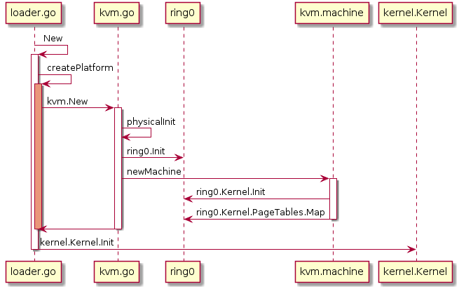

* TOC
{:toc}

### Data structures

[`Task`](https://github.com/wenboshen/gvisor/blob/master/pkg/sentry/kernel/task.go#L58) is like `task_struct`.
```
type Task struct {
	...
	p platform.Context `state:"nosave"`
	k *Kernel
	tc TaskContext
	...
}
```

[`TaskContext`](https://github.com/wenboshen/gvisor/blob/master/pkg/sentry/kernel/task_context.go#L40) contains `MemoryManager`, [`MemoryManager`](https://github.com/wenboshen/gvisor/blob/master/pkg/sentry/mm/mm.go#L51) is like `mm_struct`.

`MemoryManager` contains [`platform.AddressSpace`](https://github.com/wenboshen/gvisor/blob/master/pkg/sentry/platform/platform.go#L196), which is a interface, implemented by [`kvm.addressSpace`](https://github.com/wenboshen/gvisor/blob/master/pkg/sentry/platform/kvm/address_space.go#L72), which contains [`pagetables.PageTables`](https://github.com/wenboshen/gvisor/blob/master/pkg/sentry/platform/ring0/pagetables/pagetables.go#L28).

There are two kernel structs, [`kernel.Kernel`](https://github.com/wenboshen/gvisor/blob/master/pkg/sentry/kernel/kernel.go#L73) and [`ring0.Kernel`](https://github.com/wenboshen/gvisor/blob/master/pkg/sentry/platform/ring0/defs.go#L37).
`kernel.Kernel` contains most of kernel data structures while `ring0.kernel` only contains `PageTables *pagetables.PageTables` and `globalIDT idt64`.

### gvisor runtime components
```
docker run --runtime=runsc -it ubuntu /bin/bash
ps -aux | grep runsc
```
Will show 4 processes. 
```
wenbo	docker run --runtime=runsc -it ubuntu /bin/bash
root	docker-containerd-shim -namespace moby ...... -containerd-binary ......
root	/usr/local/bin/runsc ...... gofer ......
nobody	/runsc ... boot ...
```


This figure is from the presentation of Dawn Chen and Zhengyu He.

* `docker run --runtime=runsc -it ubuntu /bin/bash` is Application process, UID wenbo      
* `/usr/local/bin/runsc ...... gofer ......` is Gofer process, UID root     
* `/runsc ... boot ...` is Sentry, UID nobody. KVM will forward the syscall requests from Application process to this process, which runs the syscall handlers, therefore, it can be regarded as the "kernel process". 

### Sentry
Sentry is the user space kernel process. Its memory maps are
```
wenbo@wenbo-ThinkPad:~/gitrepo/wenboshen.github.io/posts$ sudo cat /proc/20284/maps
00400000-00a82000 r-xp 00000000 08:05 399683     /tmp/runsc-sandbox-chroot-437342078/runsc
00a82000-012ff000 r--p 00682000 08:05 399683     /tmp/runsc-sandbox-chroot-437342078/runsc
012ff000-01323000 rw-p 00eff000 08:05 399683     /tmp/runsc-sandbox-chroot-437342078/runsc
......
```
Seems the sentry code section is not randomized while libraries, stack and heap are randomized, the memory maps match the sections in runsc.
```
wenbo@wenbo-ThinkPad:~/gitrepo/gvisor$ readelf -S bazel-bin/runsc/linux_amd64_pure_stripped/runsc
Section Headers:
  [Nr] Name              Type             Address           Offset
       Size              EntSize          Flags  Link  Info  Align
  [ 0]                   NULL             0000000000000000  00000000
       0000000000000000  0000000000000000           0     0     0
  [ 1] .text             PROGBITS         0000000000401000  00001000
       0000000000680fe8  0000000000000000  AX       0     0     16
  [ 2] .rodata           PROGBITS         0000000000a82000  00682000
       00000000002c0c34  0000000000000000   A       0     0     32
......
  [ 8] .noptrdata        PROGBITS         00000000012ff000  00eff000
       0000000000017fa8  0000000000000000  WA       0     0     32
......
```

From log, we know currently sentry allows 55 syscalls to the host kernel, no `open` or `socket` syscalls, also mentioned in [Introducing gVisor](https://www.youtube.com/watch?v=pWyJahTWa4I&t=1743s).
```
//log file is runsc.log.20190101-213530.827234.boot

Installing seccomp filters for 55 syscalls.
......
```
 

### System calls 
For Linux kernel, [Anatomy of a system call, part 1](https://lwn.net/Articles/604287/) gives a good overview of how syscall is handled in kernel.
MSR_LSTAR is a Model-Specific Registers, used to hold "Target RIP for the called procedure when SYSCALL is executed in 64-bit mode", details in [Intel® 64 and IA-32 Architectures Software Developer’s Manual Volume 4: Model-Specific Registers](https://software.intel.com/sites/default/files/managed/22/0d/335592-sdm-vol-4.pdf) Table 2-2. On the latest kernel v4.20, [`syscall_init`](https://elixir.bootlin.com/linux/v4.20/source/arch/x86/kernel/cpu/common.c#L1535) sets MSR_LSTAR to be [`entry_SYSCALL_64`](https://elixir.bootlin.com/linux/v4.20/source/arch/x86/entry/entry_64.S#L145), which will jump to syscall according to the syscall number at [`do_syscall_64`](https://elixir.bootlin.com/linux/v4.20/source/arch/x86/entry/common.c#L272).  

For gvisor, from [How gvisor trap to syscall handler in kvm platform](https://groups.google.com/forum/#!msg/gvisor-users/15FfcCilupo/9ARSLnH3BQAJ), "On the KVM platform, system call interception works much like a normal OS. When running in guest mode, the platform [sets MSR_LSTAR](https://github.com/google/gvisor/blob/master/pkg/sentry/platform/ring0/kernel_amd64.go#L215-L231) to a system call handler [sysenter](https://github.com/google/gvisor/blob/master/pkg/sentry/platform/ring0/entry_amd64.go#L23-L32), which is invoked whenever an application (or the sentry itself) executes a SYSCALL instruction."

[`SyscallTable`](https://github.com/wenboshen/gvisor/blob/master/pkg/sentry/kernel/syscalls.go#L181) is a struct. 
All the implemented syscalls are listed in [`var AMD64`](https://github.com/wenboshen/gvisor/blob/master/pkg/sentry/syscalls/linux/linux64.go#L50).

### copy_to/from_user
All copy to/from/in user functions are in [`type IO interface`](https://github.com/wenboshen/gvisor/blob/master/pkg/sentry/usermem/usermem.go#L33)

CopyStringIn will only check overflows in [`AddLength`](https://github.com/wenboshen/gvisor/blob/master/pkg/sentry/usermem/addr.go#L38), seems no user/kernel addr limit checking, need double check

### Memory Map
[`pkg/sentry/platform/ring0/defs.go`](https://github.com/google/gvisor/blob/master/pkg/sentry/platform/ring0/defs.go#L23) defines `UserspaceSize`, `MaximumUserAddress` and `KernelStartAddress`, their values are:
```
log.Warningf("UserspaceSize %v MaximumUserAddress %v KernelStartAddress %v", 
    ring0.UserspaceSize, ring0.MaximumUserAddress, ring0.KernelStartAddress)

VirtualAddressBits	= 48
UserspaceSize		= 0x8000 0000 0000
MaximumUserAddress	= 0x7FFF FFFF F000
KernelStartAddress	= 0xFFFF 8000 0000 0000
```
Consistent with [Linux kernel memory map with 4-level page tables](https://www.kernel.org/doc/Documentation/x86/x86_64/mm.txt)

For page table, the same page table mapped both kernel and user memory range in [`applyPhysicalRegions`](https://github.com/google/gvisor/blob/fb613020c7db323c705adf6ae0f954bee4ab5fec/pkg/sentry/platform/kvm/machine.go#L192).

### Kernel setup
There are two kernel structs, [`kernel.Kernel`](https://github.com/wenboshen/gvisor/blob/master/pkg/sentry/kernel/kernel.go#L73) and [`ring0.Kernel`](https://github.com/wenboshen/gvisor/blob/master/pkg/sentry/platform/ring0/defs.go#L37).
`kernel.Kernel` contains most of kernel data structures while `ring0.kernel` only contains `PageTables *pagetables.PageTables` and `globalIDT idt64`. As shown in the following figure, `loader.go` will create a VM and setup kernel.Kernel, while the KVM will setup ring0.Kernel. Figure source is on [plantuml](http://www.plantuml.com/plantuml/uml/ZP71QeOm3CVlUOh2pfETFOpliCiO3c5xWQncManRgLNPsyyIf58S-qv9p2-_l-XjZXZYOXdOOqUXwhrwV5PvgDKxRO0wcXKZvGNyVQ03xMZB6Bzzi1Utwk45m_Y1RBqhFEDgHPAQb9pFPGMf5Emq_Cn68xyw4-441EFwfrfALIvJPr4Fnj6kSBGrCfmJCm9d_52hm_r6mH5Bn3rWYprzuXVJN3Ku0NHqcPbSvVSjM7dox-yP9LVYLPtd_DxNcXkvRh7y2m00).



#### What's the different between ring0.Kernel and kernel.Kernel
#### What's the relation between kernel and machine
#### When machine, ring0.Kernel and kernel.Kernel will be called

### Security concerns
* Sentry uses unsafe packages.
* Even Golang claimed to be a memory safe program language, but [Golang data races to break memory safety](https://blog.stalkr.net/2015/04/golang-data-races-to-break-memory-safety.html).
* Gvisor thinks 300+ syscalls are not secure, but gvisor still allows 55 syscalls to host kernel.
* Zhengyu He, gvisor's founder, mentioned that syscall `socket` and `open` have been exploited by most number of CVEs, but how to make sure that the remainning 55 syscalls are not exploited by CVEs.

