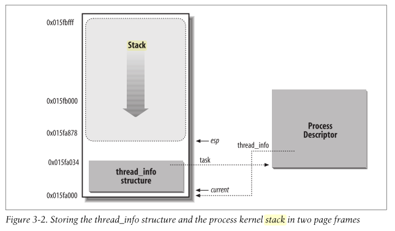

* TOC
{:toc}

### Kernel stack pages

* In kernel 2.4.0, the kernel mode stack is right above the task_struct, in do_fork, Line 669 will get two pages, the low address is for task struct, the end is for pt_regs, the address right below pt_regs is for the kernel mode stack.


*Figure credit to Linux内核源代码情景分析*

* In kernel 3.4.0, [`thread_info`](https://elixir.bootlin.com/linux/v3.4/source/arch/x86/include/asm/thread_info.h#L26) shares two pages with the kernel mode stack, see the definition of [`thread_union`](https://elixir.bootlin.com/linux/v3.4/source/include/linux/sched.h#L2139)
The user mode registers are saved in [`pt_regs`](https://elixir.bootlin.com/linux/v3.4/source/arch/x86/include/asm/ptrace.h#L21), which is on the top of the two pages, same with kernel 2.4.0, the call trace is:
[`do_fork`](https://elixir.bootlin.com/linux/v3.4/source/kernel/fork.c#L1544) -> [`copy_process`](https://elixir.bootlin.com/linux/v3.10/source/kernel/fork.c#L1132) -> [`copy_thread`](https://elixir.bootlin.com/linux/v3.4/source/arch/x86/kernel/process_32.c#L138) -> [`task_pt_regs`](https://elixir.bootlin.com/linux/v3.4/source/arch/x86/include/asm/processor.h#L855)
The kernel mode registers in process switching are saved in [`thread_struct`](https://elixir.bootlin.com/linux/v3.4/source/arch/x86/include/asm/processor.h#L437), task_struct has a member of thread_struct.




*Figure credit to Understanding the Linux Kernel*

* In kernel 3.18 aarch64, [`thread_union`](https://elixir.bootlin.com/linux/v3.18/source/include/linux/sched.h#L2241) is 4 pages large.


### Kernel stack usages

For AArch64 kernel 3.10.

* The kernel stack of a process is defined in union [`thread_union`](https://elixir.bootlin.com/linux/v3.10/source/include/linux/sched.h#L1920). The thread_info struct is at the beginning while the remaining part is kernel stack.
* struct [`thread_info`](https://elixir.bootlin.com/linux/v3.10/source/arch/arm64/include/asm/thread_info.h#L46) is different from struct [`thread_struct`](https://elixir.bootlin.com/linux/v3.10/source/arch/arm64/include/asm/processor.h#L77), which is in [`task_struct`](https://elixir.bootlin.com/linux/v3.10/source/include/linux/sched.h#L1033). thread_struct contains [`cpu_context`](https://elixir.bootlin.com/linux/v3.10/source/arch/arm64/include/asm/processor.h#L61), which contains the callee-saved registers (x19, ..., x28, x29, x30, sp).
* The end of kernel stack is [`pt_regs`](https://elixir.bootlin.com/linux/v3.10/source/arch/arm64/include/asm/ptrace.h#L94), which contains all the registers and sp, pc, pstate. The middle part of kernel stack is similar to user stack, the frame pointer (x29) which points to the bottom of current frame, which contains the frame pointer of previous frame.


* From above figure, it is easy to see that kernel stack frame is linked by frame pointer and from [`unwind_frame`](https://elixir.bootlin.com/linux/v3.10/source/arch/arm64/kernel/stacktrace.c#L38), we know that return address is at frame pointer+8, in higher address.

#### [`cpu_context`](https://elixir.bootlin.com/linux/v4.9.35/source/arch/arm64/include/asm/processor.h#L63) and [`pt_regs`](https://elixir.bootlin.com/linux/v4.9.35/source/arch/arm64/include/asm/ptrace.h#L108)
```
struct cpu_context {
	unsigned long x19;
	unsigned long x20;
	unsigned long x21;
	unsigned long x22;
	unsigned long x23;
	unsigned long x24;
	unsigned long x25;
	unsigned long x26;
	unsigned long x27;
	unsigned long x28;
	unsigned long fp;
	unsigned long sp;
	unsigned long pc;
};

struct pt_regs {
	union {
		struct user_pt_regs user_regs;
		struct {
			u64 regs[31];
			u64 sp;
			u64 pc;
			u64 pstate;
		};
	};
	u64 orig_x0;
	u64 syscallno;
	u64 orig_addr_limit;
	u64 unused;	// maintain 16 byte alignment
};
```
Both of them contains stack pointer sp and pc.

* `pt_regs` is at the high end of kernel stack, is mainly used for saving user registers in user-kernel mode switching. Therefore, after returning to user space, the first instruction get executed is at `pt_regs->pc`.

* `cpu_context` is in task_struct->thread_struct, is mainly used for saving registers of context switch. So right after context switch to a process, its `cpu_context->pc` will get executed.


#### User-kernel (syscall) mode switch
* User mode to kernel mode switch happens in [`kernel_entry`](https://elixir.bootlin.com/linux/v3.10/source/arch/arm64/kernel/entry.S#L41) in entry.S.  Note that here stack pointer grows from high address to low address, while in memory allocation of pt_regts, small number registers are in low addresses, which large number registers are in high addresses, so need push large number registers first.

* Correspondingly, kernel mode to user mode switch will pop out all these registers, as shown in [`kernel_exit`](https://elixir.bootlin.com/linux/v3.10/source/arch/arm64/kernel/entry.S#L88).

#### Context switch
* In context switch, [`cpu_switch_to`](https://elixir.bootlin.com/linux/v3.10/source/arch/arm64/kernel/entry.S#L545) in entry.S will save registers to [`cpu_context`](https://elixir.bootlin.com/linux/v3.10/source/arch/arm64/include/asm/processor.h#L61).

### References
1. Understanding the Linux Kernel
2. Linux内核源代码情景分析
